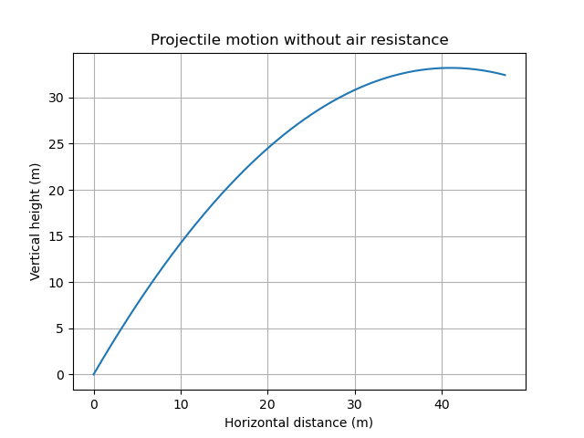

# Ballistic Simulator (Basic Version)

## Overview
This project simulates the motion of a projectile launched at an angle
without air resistance using classical mechanics.

The goal of this project is to build an intuitive understanding of
kinematics and prepare for more advanced aerospace simulations.

## Physics Model
The motion is described by the equations:

x(t) = v0 cos(θ) t  
y(t) = v0 sin(θ) t − 0.5 g t²

Where:
- v0 is the initial velocity
- θ is the launch angle
- g is gravitational acceleration

## Results
The trajectory of the projectile is shown below:

